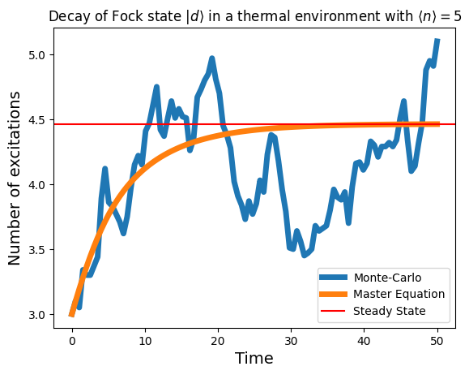

# Open Harmonic oscillator dynamics

<div align='center'>


</div>

This repository contains jupyter notebooks with simulations of coupled harmonic oscillators using [QuTip](https://github.com/qutip/qutip).


- [Project description](#About-the-project)
  - [Two open oscillators](#interaction-of-two-harmonic-oscillators-at)
  - [Three open oscillators and monte carlo](#monte-carlo-and-three-oscillators-at)
  - [$N$ open oscillators](#more-oscillators-at)
  - [Dephrasing in a $T\neq0$ environment](#one-oscillator-at)
  - [Husimi Q estimate](#extracting-the-state)

- [Code description](#about-the-code)
  - [Instalation](#installation)
  - [Code structure](#file-structure)
- [Additional Information](#additional-information)
## About the project

The project probes the dissipative dynamics of systems interacting with the following Hamiltonian

$$
H = \hbar\omega \sum_n  a^\dagger_n a_n + gH_\text{int}
$$
where $H_\text{int}$ is a bipartite interaction term between two modes 
$$
H_\text{int} = a_n \otimes a_m^\dagger + a^\dagger_n \otimes a_m
$$

This Hamiltonian is analogus to the [Jaynes Cummings Hamiltonian](https://en.wikipedia.org/wiki/Jaynes%E2%80%93Cummings_model).

This system is simulated in the following 3 scenarios:

- Two harmonic oscillators in zero temperature

- Two harmonic oscillators interacting in an environment of $N$ other harmonic oscillators. When $N$ is taken to be large (~$100$) it is shown that memory usages of classical computers are not enough.

- One harmonic oscillator decaying in a thermal environment. The environment here is approximated by a master equation (see below). The [Husimi function](https://en.wikipedia.org/wiki/Husimi_Q_representation) of the system is approximated using numerical

- Two harmonic oscillators interacting in a $T\neq0$ environment under the Lindblad master equation

$$
{\displaystyle {\dot {\rho }}=-{i \over \hbar }[H,\rho ]+\sum _{i}(^{}\gamma _{i}L_{i}\rho L_{i}^{\dagger }-{\frac {1}{2}}L_{i}^{\dagger }L_{i},\rho})
$$


### Interaction of two harmonic oscillators at $T=0$

Here a scenario of quantum systems interaction is explored. Assuming one has access to a measuring quantum system that has been prepared in an eigenstate of the number operator $N = a^\dagger a$ one can use the interaction Hamiltonian to measure an unknown system in a superposition of number states, here taken to be a coherent state.

It is shown that after some interaction time, both systems end up in a superposed state of number states. This is a testament to the way superposed states "infect" systems in eigenstates in a measurement scheme.


<table>
  <tr>
    <td align="center">
      
      <br>
      <em>Wigner function plot of the initial state of a harmonic oscillator in a coherent state</em>
    </td>
    <td align="center">
      
      <br>
      <em>Wigner plot of the final state of theoscillator after interaction with the environment.</em>
    </td>
  </tr>
</table>

Below are the occupational probabilities and phase space representations of the initial and final states of the two systems.

<div style="border:2px solid blue; padding:10px">
<table>
  <tr>
    <td align="center">
      
      <br>
      <em>Initial state (fock state) of the detector system</em>
    </td>
    <td align="center">
      
      <br>
      <em>Initial state (coherent state) of the subject system.</em>
    </td>
  </tr>
</table>

<table>
  <tr>
    <td align="center">
      
      <br>
      <em>The detector system state after interaction with the observed system</em>
    </td>
    <td align="center">
      
      <br>
      <em>The subject system state after interaction with the detector system.</em>
    </td>
  </tr>
</table>
</div>

### Monte carlo and three oscillators at $T=0$ 

A last step is to examine the solutions of a montecarlo solver providen in the `QuTip` package by using the built in `mcsolve` command. This is more well suitted for large dimensional systems. 

<table>
  <tr>
    <td align="center">
      
      <br>
      <em>Energy decrease of a single mode in a zero temperature thermal enviro</em>
    </td>
  </tr>
</table>


Afterwards, 3 harmonic oscillators are treated in a way that
only one of them interacts with an external environment so that the Lindbladian contains only jump operators of one of the systems

$$
L=L(a_1, a^\dagger_1)
$$

It is shown that even only one system directly interacts with the environment all three of the oscillators experience dephrasing.

<table>
  <tr>
    <td align="center">
      
      <br>
      <em>The expectation values of the oscillators calculated with the integral solver.</em>
    </td>
    <td align="center">
      
      <br>
      <em>The expectation values of the oscillators calculated with the monte carlo solver.</em>
    </td>
  </tr>
</table>

### More oscillators at $T=0$

A way to transition to an open system dynamics scheme is by creating a system of $k$ identical harmonic oscillators thatinteract with the interaction Hamiltonian

$$
H_{int} = a^\dagger \otimes a \otimes  I^{\otimes (k-2)} + \text{permutations}
$$

this way excitations are exchanged in the system but from the point of view of two of the oscillators the rest can be considered as an external environment. One sees that the time evolution of the entire system is unitary.

<table>
  <tr>
    <td align="center">
      
      <br>
      <em>The detector system state after interaction with the observed system</em>
    </td>
    <td align="center">
      
      <br>
      <em>The subject system state after interaction with the detector system.</em>
    </td>
  </tr>
</table>

However from the perspective of the sub-system of two harmonic oscillators, excitations seem to be lost in the environment and also appear from the environment as back action. Pushing this scheme to many systems is infeasible due to the exponential size of the Hilbert space and one runs into memory overflows ver quickly.

```
MemoryError: Unable to allocate 149. GiB for an array with shape (100000, 100000) and data type complex128
```
```
OverflowError: value too large
```

### One oscillator at $T\neq0$

Since one cannot arbitrarily increase the number of oscillators to simulate a reservoir, this would be intractable, one resorts to solving the Lindblad master equation. In `Notebooks/Thermalization.ipynb` it is shown how a single mode experiences energy decay and dephrasing in a thermal environment

<div style="border:2px solid green; padding:10px">
<table>
  <tr>
    <td align="center">
      
      <br>
      <em>Decrease in energy of a single open harmonic oscilator</em>
    </td>
    <td align="center">
      
      <br>
      <em>Dephrasing and energy decrease.</em>
    </td>
  </tr>
</table>

The same dephrasing appears when the oscillator is submerged in a more energetic reservoir, however in this case the energy of the subsystem is increasing as it reaches the steady-state.

<table>
  <tr>
    <td align="center">
      
      <br>
      <em>Increase in energy of a single open harmonic oscilator</em>
    </td>
    <td align="center">
      
      <br>
      <em>Dephrasing and energy increase.</em>
    </td>
  </tr>
</table>
</div>

### Extracting the state

Lastly, finite difference methods are employed to extract the Hushimi-Q function of the harmonic oscillator in the `/Notebooks/Q-estimate.ipynb` file.


## About the code

### Installation

You can clone the repository via

```bash
git clone https://github.com/chrishalkias/qonnect
```

### File Structure
The repository structure is as follows:
```tree
.
├── assets
│   ├── 3osc_mc.png
│   ├── 3osc_me.png
│   ├── decay_corr.png
│   ├── decay.png
│   ├── final_detector.png
│   ├── final_five.png
│   ├── final_system.png
│   ├── final.png
│   ├── init_detector.png
│   ├── init_system.png
│   ├── init.png
│   ├── initial_five.png
│   ├── mc_vs_me.png
│   ├── preview.png
│   ├── thermal_cor.png
│   └── thermal.png
├── Notebooks
│   ├── Coupled_Harmonic_Oscillators.ipynb
│   ├── More_coupled_Harmonic_Oscillators.ipynb
│   ├── N_Harmonic_Oscillators.ipynb
│   ├── Q_estimate.ipynb
│   ├── Thermalization.ipynb
│   └── Three_oscillators_monte_carlo.ipynb
├── README.md
├── requirements.txt
├── scan_nb.py
└── structure.txt
```

The code contains 6 different Jupyter notebooks concerning the simulation of the harmonic oscillator bath. As an extra there exists a simple python script to extract dependencies from jupyter notebooks.


## Additional information

<!-- <p align="center">

</p> -->

These notebooks were part of my thesis for my undergraduate diploma in physics, supervised by prof. Anastasios Petkou. The general subject of my thesis was Quantum Mechanics with an interest in the measurement problem and the dynamics of open systems. An online version of the draft can be found [here](https://ikee.lib.auth.gr/record/335194/files/Chalkias.pdf).


