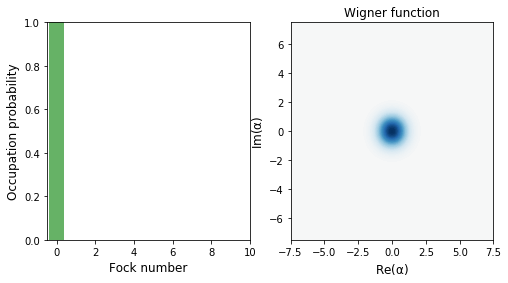
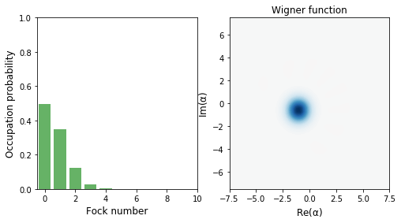

# Open Harmonic oscillator dynamics
This repository contains jupyter notebooks with simulations of coupled harmonic oscillators using [QuTip](https://github.com/qutip/qutip).

## About the project

The project probes the dissipative dynamics of systems interacting with the following Hamiltonian

$$
H = \hbar\omega \sum_n  
$$

### Interaction of two harmonic oscillators in $T=0$
<table>
  <tr>
    <td align="center">
      
       
      <em>Wigner function plot of the initial state of a harmonic oscillator in a coherent state</em>
    </td>
    <td align="center">
      
       
      <em>Wigner plot of the final state of theoscillator after interaction with the environment.</em>
    </td>
  </tr>
</table>

<table>
  <tr>
    <td align="center">
      
       
      <em>Initial state (fock state) of the detector system</em>
    </td>
    <td align="center">
      
       
      <em>Initial state (coherent state) of the subject system.</em>
    </td>
  </tr>
</table>

<table>
  <tr>
    <td align="center">
      
       
      <em>The detector system state after interaction with the observed system</em>
    </td>
    <td align="center">
      
       
      <em>The subject system state after interaction with the detector system.</em>
    </td>
  </tr>
</table>

### More oscillators at $T=0$

<table>
  <tr>
    <td align="center">
      
       
      <em>The detector system state after interaction with the observed system</em>
    </td>
    <td align="center">
      
       
      <em>The subject system state after interaction with the detector system.</em>
    </td>
  </tr>
</table>

## Additional information
These notebooks were part of my thesis for my undergraduate diploma in physics, supervised by prof. Anastasios Petkou. The general subject of my thesis was Quantum Mechanics with an interest in the measurement problem and the dynamics of open systems. An online version of the draft can be found [here](https://ikee.lib.auth.gr/record/335194/files/Chalkias.pdf).

## Harmonic Oscillators

++

**~Job list**

- [x] Create a repo
- [ ] Coupled Harmonic Oscillators
- [ ] Harmonic oscillator coupled with bath (Lindbaldian)
- [ ] Modeling with qubits
- [ ] Add a binder
